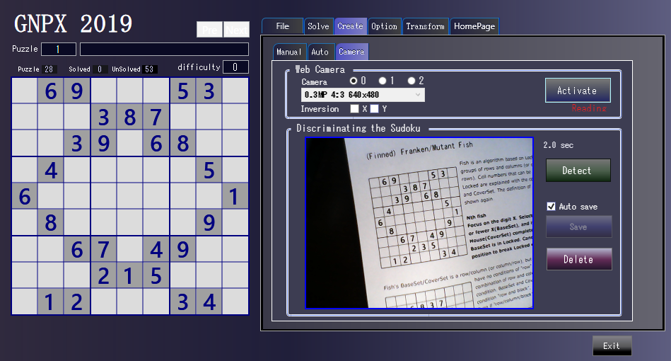

# new!  brief Manual 

# Sudoku_Solver_Generator

Sudoku analysis and generation C# program.
The only algorithm used is non-backtracking.  
The algorithm used is  
>Single, LockedCandidate, (hidden)LockedSet(2D-7D),
  (Finned)(Franken/Mutant/Kraken)Fish(2D-7D),
  Skyscraper, EmptyRectangle, XY-Wing, W-Wing, RemotePair, XChain, XYChain,
  SueDeCoq, (Multi)Coloring,
  ALS-Wing, ALS-XZ, ALS-Chain,
 (ALS)DeathBlossom(Ext.), (Grouped)NiceLoop, ForceChain and GeneralLogic. 
There are also functions for transposed transformation of Sudoku problems, standardization and ordering of Sudoku problems.  

The algorithm is explained on the HTML page.  
https://gidoo-code.github.io/Sudoku_Solver_Generator/  
https://gidoo-code.github.io/Sudoku_Solver_Generator_jp/

# Click here for version "with Camera Shooting"
https://github.com/GIDOO-code/Sudoku_Solver_Generator_withCamera

