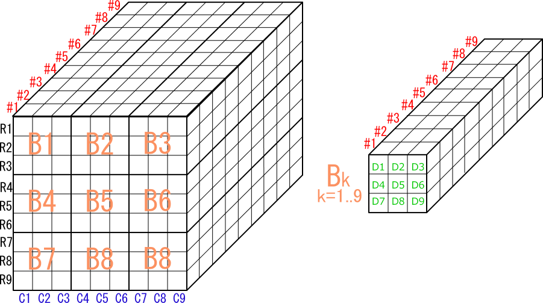
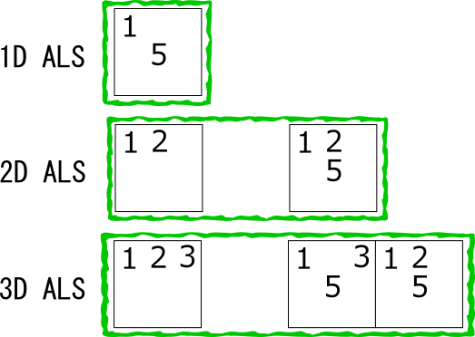
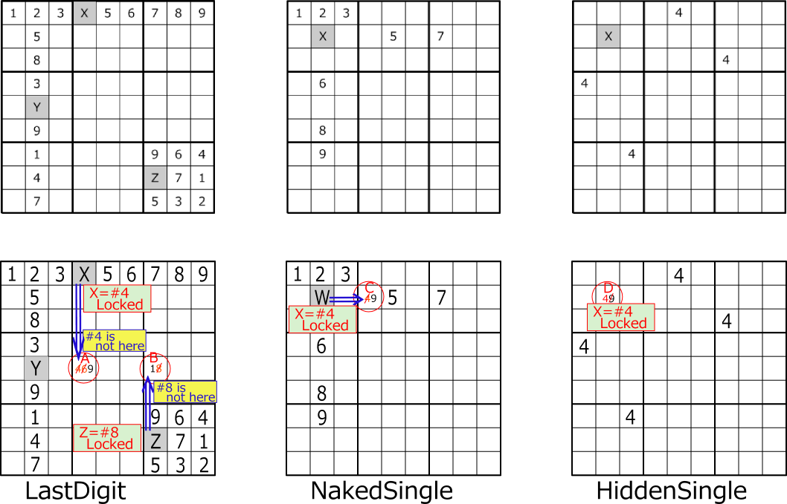
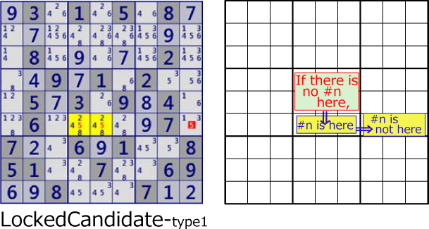

***
# Sudoku is a logical puzzle
### (Reason for not using the absurd method in the Sudoku analysis algorithm)
Sudoku is a logical puzzle. Repeat the next step to solve.
1) Sudoku solving Algorithm looks for a "locked" pattern in the phase.
2) Determine the truth of the candidate digits derived from "Locked".
3) Proceed to the next phase.
***

## Constraints
Sudoku is a puzzle in which digits(1-9) are arranged vertically, horizontally and in blocks.
Arrange digits(1-9) in rows, columns, and blocks without overlapping or omission.
One of the digits(1-9) is placed in the cell.
Sudoku has a total of 324 restrictions on these rows, columns, blocks, and cells.
In Sudoku, there are 324 constraints on rows, columns, blocks, and cells.
Row/column and block constraints are not independent.
The following symbols are used to describe each cell and constraint in Sudoku. 
 
***

# Phase
One state of Sudoku analysis is called a "phase".
In one phase, some cells have undetermined digits.
The Sudoku analysis algorithm prove that some digits are true 
or some candidate digits are true or false. 
And move to a new pahse. 
 
***

## Link (simple link)
The cell set that contains the candidate digits can represent the constraint state as a "link".
There are many groups of links in the phase.

It shows concretely. Focusing on one phase of Sudoku, Unsolved cells have candidate digits.
Candidate digits related by row/column/block/cell constraints form links.
The links shown in the following figure are just one example. 
 

Two cells link is called "Strong link".
Three or more cells is called "Weak link".
The images of ”Strong link" and "Weak link" are shown below.

For strong link, one is true and the other is false. 
 

For weak link, if any one is true, the rest are all false.
If it is false, the remaining truth is not determined.
"Strong link" is also "Weak link". 
 

## Link-2 (ALS, AIC)
The Sudoku algorithm consists of a combination of links.
ALS(AlmostLockedSet) and AIC(Alternate Inference Chain) are extended link.

ALS is a state in which there are n+1 candidate digits in n cells.
ALS Cells are in a common row/column/block.
This is a bundle of links with the same constraints, but it should be understood as ALS. 
 

ALS is a powerful method to solve Sudoku, and many algorithms use ALS. 
 

AIC is a link that occurs at the part where row(column) and block constraints overlap.
For example, when the candidate digits are arranged as follows, the link is weak.
Algorithms such as NiceLoop composed of simple Cell-Link 
can be extended to algorithms using ALS-Link and AIC-Link. 
 
***

## Locked
To understand the Sudoku algorithm, the following are important:
The state where the Sudoku digit has been confirmed or
the candidate digit has been determined to be true or false is called "Locked".
The purpose here is to understand "Locked" conceptually.
The following shows some "Locked".
The algorithm is explained on the HTML page.   
https://gidoo-code.github.io/Sudoku_Solver_Generator/page2.html 

### 1)Single
Locked with one cell and one digit is self-evident from the definition of Sudoku. 
Other elements are determined to be false in the link. 
 

### 2)1D LockedCandidate
In Sudoku, row/column and block constraints are not independent.
If the candidate is limited to the position where the row/column and block overlap, it becomes "Locked".
The candidate to break "Locked" is false. 
 
 

### 3)2D LockedSet
If two cells with two candidate digits are linked by a link, it will be "Locked".
In each cell, it is not decided which of the two candidate digits is true and the other is false, 
but it is decided that they are either.
"Locked" holds in the same way for cells 3-4.
The second example below is Locked of 2 cells 2 candidate digits of r48c6, 
but also locked of 3 cells 3 digits of r579c6,
The two Locked are in a dual relationship. The candidates for breaking "Locked" are the same.
Due to the dual relationship, the fifth or higher order LockedSet analysis algorithm is not necessary in practice. 
 
 
 

### 4)Fish
The figure below shows an example of the X-wing (2D-Fish) algorithm, 
where two sets of links are covered by two different sets of links.
There are n link sets (BaseSet) and n link sets (CoverSet), and CoverSet covers baseSet. This is "locked".
The elements of BaseSet and CoverSet are links of rows/columns/blocks/cells.
The logic for BaseSet and CoverSet is described on the HP for Extended Fish and General Logic. 
<https://gidoo-code.github.io/Sudoku_Solver_Generator/page36.html>"Franken/Mutant Fish" 
<https://gidoo-code.github.io/Sudoku_Solver_Generator/page60.html>"GeneralLogic" 
 

### 5)Skyscraper
 

### 6)Sue De Coq
If there are two ALS and candidate digits satisfies a certain condition, it becomes a strange "Locked".
In many cases, there is a simpler analysis algorithm, so Sue De Coq Locked is rarely needed.
 

### 7)another
In addition to the ones shown here, there are many Sudoku analysis algorithms. 
<https://gidoo-code.github.io/Sudoku_Solver_Generator/page2.html> ”Sudoku Algorithm” 

***

# Summary.
### Reason for not using the absurd method in the Sudoku analysis algorithm.
* The Sudoku analysis algorithm is composed of a combination of links and extended links.
* The links and extended links used in the Sudoku analysis algorithm are all links in the current phase.
* The Sudoku parsing algorithm is to find the "Locked" state of a cell/digit pattern and 
  to find candidate digit that break the "Locked" state.
* From the “Locked” state, the candidate digit is determined to be true (confirmed positive) or
  the candidate digit is false (confirmed negative).

#### The absurd method (assumed method) advances the phase each time the truth of the candidate digit is   assumed, and uses the link in the next phase.
i do not accept the absurd method (the hypothetical method) as a method of solving Sudoku. 
Because it is ad hoc and not logical.
***

# Supplement
The Sudoku analysis algorithm is integrated into "General Logic" that includes these in a unified manner. 
<http://www.sudokuone.com/sweb/general.htm>"A General Logic for Sudoku" 
<https://gidoo-code.github.io/Sudoku_Solver_Generator/page60.html> ”Sudoku Algorithm” 
Since "General Logic" is general-purpose, there is a problem in the efficiency of solving.
***
